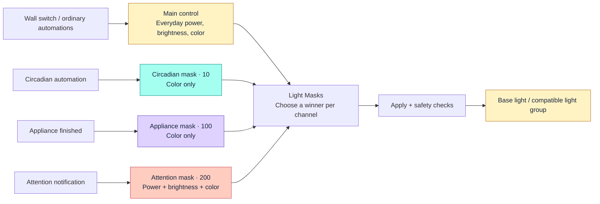
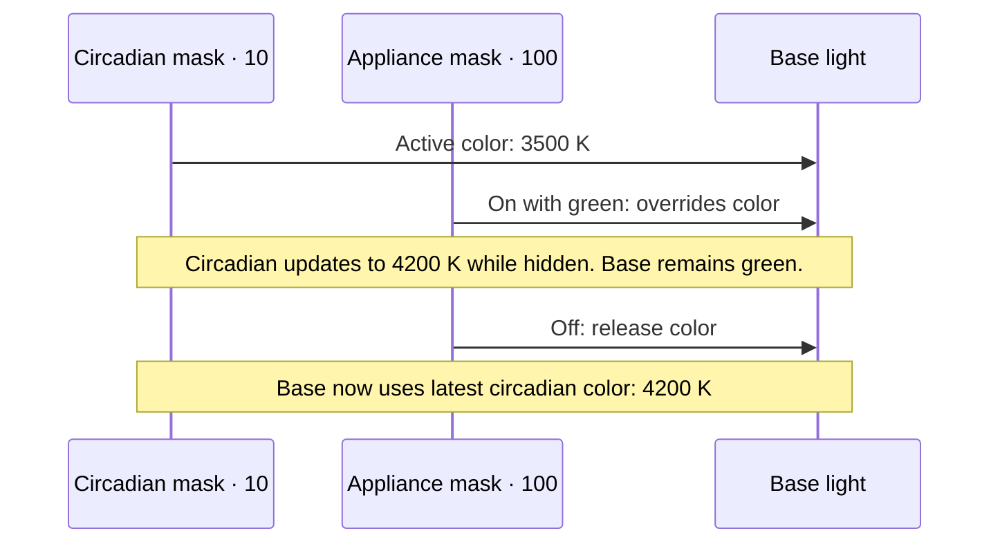

# Light Masks


### Many automations. One light. No tug-of-war.

Let the wall switch control power, circadian lighting choose the color temperature,
and a finished appliance show a notification on the **same light**.
Each automation talks to its own normal-looking virtual light. Light Masks combines
their requests and sends one resolved result to the real bulb or compatible light group.

**Beta: 0.4.0b3** · **Home Assistant: 2026.9.3 development baseline** ·
**UI: English / Ukrainian** · **License: [MIT](LICENSE)**

[Get started](#get-started) · [Terminology](#terminology) ·
[Usage scenarios](#usage-scenarios) · [Configuration](#mask-editor-and-device-indicators) ·
[Compatibility](#compatibility-and-boundaries) · [Verification](https://github.com/gigazet/ha_light_masks/blob/main/docs/verification.md)

> **Mask On means "contribute." Mask Off means "release."**
> It does not necessarily mean the physical light turns On or Off.

No custom actions are needed in everyday automations: use HA's normal light actions.
You **do** need to retarget automations and scenes from the base to Main control or
the appropriate mask. Light Masks does not intercept arbitrary writes to the base,
automatically migrate automations, or guarantee that changing targets alone suits
every trigger.

## Get started

1. [Install manually](#manual-installation) or through a
   [HACS custom repository](#hacs-installation-and-repository).
2. Add **Light Masks** in **Settings > Devices & services** and select a base.
   The base is fixed after setup; there are no pre-created notification masks.
3. Target **Main control** from everyday lighting controls. In **Configure > Add mask**,
   create one mask per independent purpose and select its controlled channels.
4. Try the virtual lights with **Apply Off**. Inspect
   [Explain](#diagnostic-actions) to see which request wins without changing the bulb.
5. Audit competing base/group writers, then enable **Apply to output**.
   If startup protection is holding an On request, review the desired state before
   pressing **Resume**: it may turn the light on.

## How it works



**Priority is per channel, not winner-takes-all.** A high-priority color mask can
win color while Main control still supplies power and brightness. There is no
color blending: the highest active, eligible request replaces that channel.
Lower-priority values keep updating behind the winner.

For example, with all rows below active:

| Source | Priority | Power request | Brightness request | Color request |
|---|---:|---|---|---|
| Main control | Baseline | **On: wins** | **40%: wins** | Warm white |
| Circadian | 10 | Pass through | Pass through | 3500 K |
| Appliance finished | 100 | Pass through | Pass through | **Green: wins** |
| **Physical result** | | **On** | **40%** | **Green** |

If Main control is Off, this same set of appearance-only masks leaves the bulb
Off. When the appliance mask releases, the newest circadian color is revealed,
not a snapshot captured before the notification.

## Terminology

| Term | Meaning |
|---|---|
| **Base / output** | The existing light or compatible HA/Zigbee2MQTT light group receiving the final commands. Ordinary automations should no longer write to it directly. |
| **Main control** | The generated baseline light. Remembers everyday power, brightness and color underneath all masks. Use it for normal lighting. |
| **Power alias** | Optional on/off-only light sharing Main control's power state. Not another mask or independent priority. |
| **Mask / layer** | An independent virtual light with its own stored values, activation, priority and channel permissions. "Mask" is the UI term. |
| **Intent** | What a virtual light requests, even when another mask hides it or the base is Off. |
| **Channel** | One separately resolved property: power, brightness or color. |
| **Color / appearance** | RGB color or color temperature, as supported by the base. `appearance` is the internal key used in diagnostics and Clear Fields. |
| **Priority / z-order** | A unique number from **1 to 1000** within one setup. **Higher wins**; 100 overrides 10. Main control is below every mask. |
| **Active** | A mask is On and eligible to contribute. It need not be visible or be the winning request. |
| **Transparent / pass through** | A channel is disabled or its mask value is unset, so a lower-priority request supplies it. |
| **Release** | Turn a mask Off. Removes its contributions but keeps its values for its next activation. |
| **Duration / lease** | Optional activation timeout. Each accepted On renews it; 0 disables expiry for the next activation. |
| **Compositor** | One Light Masks integration entry: its base, Main control, masks and output writer. |
| **Shadow mode** | Apply is Off. Requests are stored and combined, but not sent to the base. |
| **Delivery status** | Whether physical feedback agrees with the desired result. Different from a mask's activation or permissions. |

## Multi-zone native groups (0.4.0b3 beta)

**Opt-in beta feature; not included in stable 0.3.4.** Existing
single-output entries keep their configuration, entity IDs, saved intent and
reconciliation rules. There is no automatic conversion or live migration.

Beta 2 fixes late member confirmation being ignored while another zone retries.
Provisionally unverified zones remain watched within the active delivery's bounded
retry window, without additional commands. Terminal failed/unverified latches
after the writer finishes are unchanged.

Beta 3 increases only multi-zone confirmation to **5 seconds plus the requested
transition**, measured after each native HA service call returns. Single-output
entries retain **3 seconds plus transition**, including native-group outputs.
Complete matching member feedback still finishes early after transition completion.
No-report zones are not resent merely to extend observation; feedback arriving
after the writer finishes does not automatically clear terminal multi-zone latches.

Choose **Multi-zone native Zigbee2MQTT compositor** when adding an integration.
Leave Base empty (the optional Power alias is ignored in this mode). Add at least
two named native groups, then uncheck **Add another zone** on the last one.
Optionally select one whole-room native group and confirm Main-control routing.
Zones must be disjoint, belong to the same bridge and have identical supported
color modes, Kelvin ranges and transition support. The optional aggregate must
contain **exactly** their combined membership. Unknown roots/members are not Off:
initialize and verify a uniform native On/Off state within each zone before
enrolling. Different zones may have different power states.

One entry owns the complete leaf set. The aggregate is only a native delivery
address, not another zone or owner. The integration issues one native aggregate
call only when every zone needs an identical normalized command and transition;
otherwise it calls only the native zone groups needing updates. It never sends
leaf light service calls, even on retry. Different zone calls are ordered, but
not delayed by each preceding zone's full acknowledgment timeout. No atomic radio
delivery or simultaneous physical response is promised.

### Zone/whole Main and shared masks

Each zone has its own **Main control**, storing ordinary On/Off, brightness and
color. The compositor's **Main control** operates on all these intents in one
durable update, rather than storing another overriding baseline.

| Whole Main operation/state | Meaning |
|---|---|
| On state | At least one ordinary zone is On, not necessarily all physical bulbs |
| Off state | All ordinary zones are Off |
| Toggle | Any ordinary zone On: request all Off; otherwise request all On |
| Turn On | Request every zone On; omitted brightness/color preserves each zone's values |
| Set brightness/color | Normal HA Turn On semantics: request every zone On and set supplied fields |
| Turn Off | Request every zone Off without clearing remembered brightness/color |
| Mixed values | No average; `mixed_power`, `mixed_brightness`, `mixed_appearance`, `on_zone_count` and `zone_count` describe the ordinary intents |

When ordinary colors differ, whole Main reports HA's `unknown` color mode with
unset color values. HA can also hide its brightness value in this mode; the
individual Main lights and Explain retain the actual values.

Create shared masks with the same existing mask editor. Each mask has **one**
activation, payload and optional renewable expiry, applied to every zone.
An appearance-only circadian mask changes lit zones without waking dark ones.
A higher-priority alarm with power/brightness/color enabled overrides all zones.
A manual zone Off during that alarm is **remembered without hiding the alarm**.
Releasing the alarm reveals each zone's latest ordinary intent and latest
circadian contribution, not a pre-alarm snapshot. One mask Off releases its
contribution everywhere; it is not a forced Off command. No zone-specific masks
or optional Power aliases are created in multi-zone mode.

Zone Main lights expose `role: normal`, `scope: zone`, and `zone_id`; whole Main
exposes `role: normal`, `scope: whole`. Discover actual entity IDs in the registry.
**Configure > Rename zone** changes display names without changing IDs, membership
or stored intent. Zone/aggregate topology is fixed; recreate and review the entry
to change it. Each zone has a delivery diagnostic sensor; Explain includes
per-zone normals, resolutions, member IDs, authorization, attempts and errors,
plus the latest delivery's native transport addresses.

### Safety and commissioning

Normal physical-switch automations, dashboards and scenes must call the zone or
whole **Main** facades. There is no external command listener or automatic
multi-zone intent adoption from telemetry. Direct native-group commands and bound
remotes bypass composition and can visibly interrupt an alarm. A same-state
physical command may produce no report, so it cannot reliably be remembered.
Electrical power loss makes hardware unavailable; it does not prove ordinary Off.

**User-confirmed availability policy:** an unknown/unavailable zone root or member
blocks that entire zone, while healthy zones continue ordinary/shared-mask/alarm
delivery through their native groups. No per-bulb fallback is used. Overall status
is `degraded`, never `in_sync`, while a zone or the aggregate alias is unavailable.
An unavailable alias alone does not block healthy zones. The aggregate is never
used across a blocked zone, including retries; a command already sent cannot be recalled.
Each member must confirm its own zone's desired result. Partial success retries
only unresolved zones; no report is not
an acknowledgment. Service exceptions remain failures even if telemetry matches.

Unavailable zones retain latest durable ordinary and shared-mask intent. On
reconnect, revalidate topology and resolve the **current** intent, including manual
Off and mask expiry accepted during the outage. Existing On authorization may be
used; reconnect reports never grant new authorization or infer ordinary intent.
An active alarm still wins over remembered Off until it releases. Reconnecting an
alias does not erase a zone's failed/unverified delivery status.
Core may omit unavailable entities' membership/capability attributes. Frozen
enrollment metadata is used only to prove isolation, never to authorize delivery
to unavailable hardware. Current registry provenance and ownership remain mandatory;
changed membership/capabilities, removed registry identities or otherwise unsafe
topology block the whole compositor. Known-state external divergence still suspends it.
First enrollment requires known uniform zones. Existing entries can restart with
unavailable zones and intact registry identities using stored intent; no snapshot
means setup fails rather than seeding unknown zones.

After restart, On authorization comes from each zone's own known-On leaves,
with a known zone root, never the aggregate root. Explicit zone On authorizes that zone, whole Main or
force-On mask activation authorizes all zones, and Resume explicitly authorizes
the whole compositor. Apply and Sync alone do not override startup protection.
Existing mask restart/lease policies and config-edit activation preservation apply.

Before live commissioning, back up configuration and stored intent, install a
separately approved version and restart. Preserve unrelated notification entries.
Remove conflicting ownership only after reviewing its consumers; this integration
does not remove entries for you. Create the new entry **Apply Off**, discover
facades, initialize ordinary intents and configure shared masks inactive. Retarget
all normal writers and audit broad area/domain actions and direct bindings.
Inspect Explain before deliberately enabling Apply/Resume. Verify alarm On, zone
Off while the alarm stays visible, then alarm release leaving that zone Off.
Observe every member and check restart/disconnect behavior before relying on it.
Rollback requires disabling Apply and reviewing/restoring the previous input
routing; never leave two output writers enabled.
Older releases cannot read multi-zone intent snapshots: disable/remove the new
entry before downgrading. Existing single-output entries require no conversion.

## Usage scenarios

These are suggested configurations, not automatically created presets.
Create masks through **Configure**, and select their actual generated entity IDs
in HA's action editor. Names below are examples, not IDs to copy.

| Purpose / target | Priority | Control on/off | Control brightness | Control color | Suggested duration |
|---|---:|---|---|---|---|
| Everyday lighting → **Main control** | Baseline | Built in | Built in | Built in | Not applicable |
| Circadian → **Circadian mask** | 10 | No | No | Yes | 0 |
| Washer/dishwasher → **Appliance finished mask** | 100 | No | No | Yes | 60 seconds |
| Temporary dimming → **Dim mask** | 50 | No | Yes | No | 0; release explicitly |
| Attention → **Attention mask** | 200 | Yes | Yes | Yes | 30 seconds |

### 1. Circadian color without fighting the wall switch

Use Main control for ordinary On/Off and brightness. Activate the color-only
Circadian mask and let the circadian automation update its color temperature.
The mask does not wake a dark room, and Main control Off still switches the bulb Off.

A condition that checks whether the **mask** is On now checks its activation,
not whether the room is lit. An automation triggered only by the physical light
turning On needs review: turning Main control On does not itself activate the mask.

### 2. An appliance finishes: show green, then return naturally

Turn the Appliance finished mask On with green RGB color. If the room is lit,
it becomes green at the existing brightness. If the room is dark, it stays dark.
Turn the mask Off when acknowledged, or let its duration expire.

No scene snapshot or restoration action is needed. Circadian changes made during
the notification remain stored and become visible when it releases.
If the appliance action also supplies brightness, that value stays local because
this mask's **Control brightness** is unchecked.



*The arrows illustrate effective contributions through Light Masks, not direct
mask-to-bulb service calls. Main control stays On throughout this example.*

### 3. A notification that may turn on a dark room

Enable all three channels on an Attention mask. Turning it On with a color and
brightness requests physical On, even when Main control is Off. Its higher
priority hides the appliance notification; that notification can keep updating.

Release Attention to reveal the next eligible requests. If only color-only masks
remain and Main control is Off, the bulb turns Off. If another power-enabled mask
is still active, it may stay On.

**This is a visual convenience, not a safety-critical alarm system.** Outages,
Apply Off, startup protection and suspension can prevent delivery. Do not rely on
a decorative light as the sole notification for an emergency.

### 4. Dim temporarily without changing the chosen color

Configure a brightness-only mask and activate it at, for example, 20%. It can dim
the light while the Circadian or Appliance mask supplies color. Releasing it
reveals the latest Main control brightness. It cannot wake the room because it
does not control power. A higher-priority brightness-enabled mask, such as the
Attention example, overrides it.

### Retained values are deliberate

Appearance-only masks ignore their stored brightness during composition. They
still accept brightness through normal light actions because HA color lights also
support brightness. Color is atomic: a winner contributes one color representation.
Unset mask fields are transparent. Off retains values for the next activation;
`light_masks.clear_fields` explicitly clears them.

Default masks leave power **transparent**. Checking **Control on/off** makes an
active mask contribute On at its priority; turning it Off releases that contribution,
not the underlying light. This can override the ordinary switch, so leave power
unchecked for routine appliance notifications. Existing 0.1 `force_off` masks keep
their behavior and expose a legacy checkbox when edited: On holds the output Off,
and Off releases it. New masks do not offer that inverted behavior.

## Mask editor and device indicators

New mask names start blank and must be entered. **Control brightness** and
**Control color** are separate checkboxes; color covers RGB and color temperature
supported by the base. **Higher priority numbers win**: 100 overrides 10,
independently for each selected channel.

**Control on/off** unchecked means the mask cannot wake or switch off the base.
For example, an appearance-only washer mask can show green while the room is
lit, but does not light a dark room. Checked means an active mask requests On
at its priority, even when Main control is Off. A higher-priority power mask
can override that request; Apply and startup/safety protections still apply.
Turning the mask Off releases its request: the base then follows Main control
or another active power mask, so it does not necessarily turn Off.

Each mask device now includes three read-only diagnostic indicators:
**Control on/off**, **Control brightness**, **Control color**. They show configured
permissions even when the mask is Off or hidden by a higher-priority mask, not
current channel ownership. Power distinguishes **Enabled: requests On** from
the older **Enabled: requests Off** behavior. Edit permissions in Configure;
these are not switches. Indicators update after edits and are removed with the
mask. They can also be displayed using ordinary sensor cards. The standard HA
color-light card still includes a brightness slider; an unchecked brightness
permission means that value does not affect physical brightness.

Editing **Maximum duration** does not alter a running timer. If 20 seconds remain,
the mask still releases in 20 seconds, even if you save a duration of 0. The next
`light.turn_on` starts a fresh timer using the new duration, including a
color/brightness update while the mask is already On; 0 then disables expiry.
An On command with brightness 0 is treated as Off and releases the mask instead.
The compatibility checkbox is shown only for an older Off-requesting mask.
With power control enabled, checked means active = request darkness, and mask
Off = release darkness. Unchecking it changes the active request to On;
unchecking Control on/off removes power control. Saving can affect the base
immediately. Ordinary new masks need no legacy setting.

## Compatibility and boundaries

The development baseline is **Home Assistant Core 2026.9.3 / Python 3.14.7**.
No earlier or later Core version is qualified. The integration uses native config
subentries and has no additional runtime pip requirements.

Supported outputs are individual lights, registered Home Assistant light groups,
or recognized Zigbee2MQTT light groups advertising only these modes:
`onoff`, `brightness`, `color_temp`, `xy`, `hs`, `rgb`.
Core performs normal light-service conversions, such as RGB requests to XY.
Only select channels the endpoint actually supports.

Groups require identical supported color-mode sets, Kelvin ranges (when supported)
and transition support across all members. Nested HA light groups are supported
without cycles or repeated members. Every member must be available. Membership is
fixed when enrolled; changing it blocks output, including after reload. Restore
the original membership or recreate the Light Masks entry after reviewing consumers.
Overlapping member ownership between Light Masks entries is rejected.

HA group commands use HA's light-group service. **Zigbee2MQTT group commands target
the native MQTT group light entity**, including single-member groups; Light Masks
never expands native group delivery into individual bulb service calls. Zigbee2MQTT
owns the underlying radio transport; no atomicity or physical simultaneity is promised.
Confirmation checks every leaf light; aggregate averages and
"any member On" cannot establish success. In single-output mode Main control stores one common intent,
not a snapshot of each bulb. Applying it can unify previously different member
settings. Mixed On/Off at startup needs explicit On authorization before waking
off members. Member divergence suspends group output even with no active masks.
Membership edits cannot cancel a group command already dispatched.

### Zigbee2MQTT groups (0.3.4)

Recognition requires an entity registered by `mqtt`, attached to a device with
manufacturer `Zigbee2MQTT`, model `Group`, and an MQTT identifier shaped
`zigbee2mqtt_<namespace>_<numeric group id>`. Its `via_device_id` must identify a
`Zigbee2MQTT` / `Bridge` device belonging to the same MQTT config entry. Names and
user overrides do not establish group identity.

The group must expose a nonempty `group_entities` list of light entity IDs and no
competing `entity_id` membership attribute. Each direct member must be registered
by MQTT on the same config entry and bridge, with a device MQTT identifier
`zigbee2mqtt_0x<16 hexadecimal digits>`. Native groups cannot contain groups,
unregistered members or compositor facades. Compatible HA groups may wrap native
groups; repeated/overlapping leaves remain forbidden.

All members must expose compatible capabilities and available feedback, even for
a single-member group. Missing discovery/membership fails closed. An optimistic
group report alone cannot confirm delivery. Member reports may themselves be
optimistic; `in_sync` is not independent verification of radio reception.
Recognition trusts HA's registry and discovered membership, not a separate audit
of MQTT topics or the radio's actual group table. Keep discovery synchronized with
Zigbee2MQTT and audit external bindings, aliases and writers before enabling Apply.

No new runtime dependency or entry migration is required. Install the updated
component and restart HA before enrolling native groups. Existing supported
individual-light and HA-group entries retain their configuration and intent.
Native effects remain unsupported; use static color commands.

Not supported:

- Mixed-capability or unknown/vendor groups other than the recognized Zigbee2MQTT
  groups above, Lightener/Lightener Studio outputs, other masks, overlapping segment
  aliases, RGBW/RGBWW/white-mode endpoints, selecting native effects through masks,
  and flash actions.
- Automatic automation migration, base-light replacement, arbitrary cross-entry
  synchronization, or a visual composition preview. Native multi-zone broadcast
  planning is opt-in in the 0.4.0b3 beta; it is not in stable 0.3.4.
- Attributing every hardware report to a human or a specific external automation.

Unsafe aggregates and duplicate owners are rejected. The independence-confirmation
checkbox has been removed; validation examines known HA membership instead.
Opaque vendor groups and aliases cannot always be detected. Do not configure an output or member controlled by another
compositor, direct Zigbee binding or still-competing automations.

**Lights reporting effects are supported from 0.3.3**, including compatible group
members. An `effect` attribute alone no longer blocks setup, reload, Resume or
static output commands: some integrations retain the last effect selection even
after a static-color command. Effects remain unmanaged. Light Masks neither
selects, stops nor restores them, and does not send a guessed `effect: none`.
Whether a static command stops a running effect depends on the device.
Effect-only reports do not trigger corrective writes; reported power, brightness
and color changes still follow the existing reconciliation and suspension rules.
`in_sync` confirms only those reported channels, not that a physical animation
has stopped. Verify the visible result before relying on a device for notifications.

Masks are visible, ordinary light entities on individual devices, not Helper
entries. They are **not excluded from area/floor/domain-wide actions or voice
exposure** by this integration. Audit those targets and assistants before applying.
An untargeted `light.turn_on` can activate masks, including power overrides.
Use explicit virtual entity IDs; manage areas, labels and exposure yourself.

## Manual installation

1. Back up Home Assistant configuration. Build or obtain `light-masks-0.4.0b3.zip`
   (local builds are in `dist`) and extract it.
   Copy its `custom_components\light_masks` directory into the Home Assistant
   configuration directory's `custom_components` directory. Do not copy `.venv`,
   tests or the development dependency files into Home Assistant.
2. Restart Home Assistant when convenient. Installation and restart are manual.
3. Open **Settings > Devices & services > Add integration > Light Masks**.
   Select an available light or compatible HA/Zigbee2MQTT light group. The base is fixed
   after setup. **Name** is optional and defaults to the base's display name.
   It labels the integration/devices only, not lighting behavior. Leave the
   optional Power alias unchecked unless switches need an on/off-only port that
   shares Main control's state.
4. Open this integration entry's **Configure** menu. Use **Add mask**, **Edit mask**
   and **Remove mask** to manage the number of masks. Each has a name, unique
   priority, **Control on/off**, **Control brightness**, and **Control color**
   checkboxes with inline help, restart restore policy and optional
   maximum duration. Native **Add mask / Configure mask** subentry actions remain
   available and use the same validation.

Initial setup is **shadow mode**: intent changes are stored but no hardware
commands are sent. Observed attributes seed Main control; missing attributes use the
configured brightness/CCT fallback or white for RGB-only endpoints. Kelvin is
clamped to the physical endpoint's advertised range.

English and Ukrainian UI resources are included. Entity IDs depend on the chosen
names; discover the generated IDs instead of copying guessed IDs from examples.
Power-only masks expose an on/off control; brightness-only masks expose dimming;
color masks expose the base's supported color modes. HA color modes also imply a
brightness control, but an unchecked brightness contribution remains local.

## HACS installation and repository

Add the public repository
`https://github.com/gigazet/ha_light_masks` under **HACS > Custom repositories**,
category **Integration**, and download Light Masks. Restart HA, then follow setup
above. HACS installs the integration directory; the manual-install ZIP is not a
HACS `zip_release` asset. The minimum declared HA version is 2026.9.3.

**Beta opt-in:** update repository information in HACS, choose **Redownload**,
expand **Need a different version?**, and select the `v0.4.0b3` prerelease.
Older HACS versions may require enabling beta versions first. Restart HA and
verify that the installed integration version is `0.4.0b3` before configuring
zones. Stable users can remain on `v0.3.4`; this beta is a GitHub prerelease, not
the latest stable release. This is a custom-repository installation, not a new
default HACS catalog listing. Follow the multi-zone commissioning and downgrade
precautions above; do not downgrade with a multi-zone entry still enabled.

The repository includes `hacs.json`, integration-local branding, an MIT license,
and GitHub Actions for tests, Ruff, mypy, hassfest and HACS validation. This does
not constitute a default HACS catalog listing or certification. Tests and hassfest
run for both private and public repositories. The HACS job is explicitly skipped
while the repository is private because its manifest checks download files through
public raw URLs; a checkout does not resolve that limitation. It runs automatically
once the repository is public and requires appropriate repository metadata:
description, relevant topics and issues enabled. A skipped HACS job is not a HACS
validation pass. Before releasing, run the checks below, run the full GitHub
validation including HACS, and create a version-matching tag/release. No publishing
is performed by the package builder.

### Branding

The original mark uses three mask-bearing layers above a warm bulb: coral,
violet and mint represent independent light intents. The transparent icon is
provided at 256 px (`brand/icon.png`) and 512 px (`brand/icon@2x.png`), with an
editable `brand/icon.svg` vector version, all under `custom_components/light_masks`.
After installing the development dependencies, run `python scripts/generate_brand.py`
to regenerate the artwork and `dist/brand-preview.html` (light/dark backgrounds,
including compact sizes). Geometry and palette live in that generator; edit it
to keep vector and raster exports consistent. Pillow is a development-only
dependency, not an integration runtime requirement.

## Configure and upgrade

**Configure > Name and main control** shows the fixed base and explains which
entity ordinary automations should target. Only the name is editable here,
including when the base is unavailable. Renaming does not change entity IDs,
intents, Apply or On authorization. To use another base, create a new entry and
deliberately retarget its consumers. The old entry/output is not changed for you.

Mask name, priority and channel edits preserve identity, independent values,
activation and current lease deadlines across a successful configuration reload.
Changed permissions and priority take effect immediately. Editing a name updates
the integration-provided device name; user-customized names/IDs remain yours.
Removing a mask requires confirmation, removes its device/entity and saved intent,
and reveals the current lower-priority result. References in automations, scenes
and dashboards are not rewritten.

To upgrade from an earlier version, back up HA and replace the component files, then restart.
Keep the existing integration entry; config subentry IDs and storage format are
unchanged. **Normal is now named Main control**, but existing entity IDs (including
ones ending in `_normal`) and saved state are preserved. User-customized names
are preserved too. Internal diagnostic keys still use `normal`.
Existing Power aliases and legacy force-off masks are retained.
Integration-hidden masks become visible; user-hidden masks stay hidden. The
upgrade restart still applies each mask's restore policy. A user-installed
**0.3.1 pilot passed the scoped live checks**; see
[the anonymized evidence and its limits](https://github.com/gigazet/ha_light_masks/blob/main/docs/verification.md#user-installed-live-test-031).
That run used one physical bulb, not a light group, and did not exercise duration
or editor changes on the live instance.

## Safe commissioning

Exercise the masks manually in shadow mode and inspect `light_masks.explain`.
Audit and retarget every physical writer, group consumer and scene before enabling
Apply. Then verify on hardware: notification while lit, notification while dark,
switch Off during notification, lower color updates while hidden, notification
release, disconnect/reconnect and restart. Keep the original light available as a
manual escape hatch.

Start with one non-critical bulb before moving to a compatible group. Check
area-wide actions, scenes, voice exposure and direct device bindings as well as
explicit automation targets. Keep existing household behavior unchanged until
you have deliberately reviewed its migration.

## Persistence, leases and recovery

Accepted input mutations are serialized and written through HA Store using atomic
file replacement **before** virtual state publication. This includes appearance
updates; this release does not batch them. Frequent animation frames therefore produce disk
writes and are not the intended use. Filesystem/hardware power-loss durability is
not an fsync guarantee.

HA Store normally logs and swallows some write failures. `IntentStore` converts
those failures to explicit errors, and rejects acceptance during shutdown or
read-only operation. This small private-API adapter is covered against the pinned
Core version and must be reviewed when upgrading Core. A storage failure rejects
the command, blocks output and raises a Repair; fix storage, Resume, then resubmit
the rejected command.

Main control intent and operating mode persist. Mask values persist, but activation
after a **restart or manual reload** restores only when **Restore activation** is
enabled. Successful configuration-edit reloads instead preserve current activation
and deadlines, including other non-restoring masks. Expired leases never reactivate.
Same-output edits retain existing power-authorization and safety barriers.
Entity identities survive ordinary reloads; a failed reload does not leave a
state-preservation handoff for a later manual retry.

Duration **0 disables automatic expiry** in the UI. A positive duration sets an
absolute deadline and every accepted On renews it. Off cancels it; Clear Fields
does not renew it. Expired masks are removed before delivery, and a one-second
timer releases runtime expirations without polling the device. Expiry uses an
immediate transition request; actual device timing is not guaranteed. Editing
duration does not recalculate an existing retained lease.

Startup cannot replay a restored On into an observed-off output without new
authorization. An explicit normal On, an explicit advanced force-on activation,
or Resume authorizes On. Ordinary appearance-mask updates do not. An initial
unavailable endpoint delays integration setup; once loaded, virtual entities
continue accepting intents during outages.

| Control / status | Meaning |
|---|---|
| Apply Off / Shadow | Store and resolve only. Does not undo an already-dispatched command. |
| Apply On | Deliver current intent subject to startup and safety barriers. |
| Resume | Revalidate, clear suspension and authorize On. **May wake the light** when Apply is enabled. |
| Sync | Retry current result; does not clear suspension or authorize startup On. |
| Pending | Physical delivery or confirmation is underway. |
| In sync | Every output member reports the normalized desired state within tolerance. Not independent proof of emitted light. |
| Unverified | A call returned but no confirming state report arrived; automatic retries stop. |
| Failed | Bounded delivery failed, storage failed, or the endpoint became unsafe. Inspect diagnostics/Repairs. |
| Suspended after external change | Output changed unexpectedly while masks were active, or a group member diverged; intents remain intact and rendering pauses. |

One replace-latest writer serializes physical calls. Hidden changes cause no
additional output calls; superseded queued work is discarded. There are at most
three attempts per effective result, with transition-aware confirmation windows,
not unlimited retrying. Retries wait through the acknowledgement window; no
exponential backoff or separate 50 ms debounce is implemented.
The per-attempt window is 5 seconds for multi-zone entries and 3 seconds for
single-output entries, plus transition time after the native service returns.
Three attempts are a retry ceiling, not three guaranteed observation windows.
The separate service-call watchdog remains 15 seconds plus transition, and the
0.75-second observation settlement delay is not extra acknowledgment grace.

For an individual output, an external settled change with no active masks can
become the normal baseline. With active masks, or for any group-member divergence,
it suspends output instead of copying notification color into Main control.
An outage defers delivery until every member is available; previously authorized
intent can then resume. Endpoint faults remain blocked until reviewed and resumed.
Changes during in-flight transitions cannot always be identified as
external; exclusive targeting and hardware qualification remain necessary.

An output entity rename is resolved by its registry ID **on reload**, not
immediately. A missing registry entry or incompatible stored color after a device
capability change fails visibly. Recover the original output or recreate the
entry for a different base; Configure cannot replace it.
Do not manually edit the integration's storage.

Scenes can snapshot ordinary mask state/values, but do not preserve unset-field
metadata or leases. Snapshotting an already-active mask can later restore it active.
Use dedicated masks per producer and prefer a straightforward final Off/release.

## Diagnostic actions

The integration exposes `light_masks.explain` (response data), `sync`, `resume`,
and `clear_fields` in Developer Tools > Actions. All select a Light Masks config
entry. Clear Fields additionally selects its mask entity and `appearance` and/or
`brightness`; it cannot clear Main control's fallback.

Since 0.3.2, these four management actions require an **administrator** when called
with a user context. Non-admin and unknown users are rejected before accessing
the entry. Trusted internal calls without a user context, such as scheduled
automations, remain supported. A manually started automation carrying a non-admin
user context is also subject to this restriction. Ordinary virtual-light actions
continue to use Home Assistant's normal entity permissions.

Explain and downloadable integration diagnostics report intents, channel winners,
desired/observed values, revisions, attempts and power authorization. Diagnostic
data is scoped to this compositor, not the entire home, but may still contain
household-identifying entity IDs and light state. Review and redact diagnostics
before attaching them to a public issue.

## Rollback

With Apply enabled and the output healthy, release masks and verify the desired
normal result. Turn Apply off, retarget consumers/scenes to the original physical
entity, then remove the Light Masks config entry. Removal deletes its stored
intent and virtual entities, not the physical light. It does not restore an old
scene or send hardware commands. Remove the custom component directory and restart
only after no remaining Light Masks entries or consumers need it.

## Development and verification

Use `uv sync --group ha` with the checked-in `uv.lock`, then:

```powershell
.\.venv\Scripts\python.exe -m pytest tests\light_masks -q --timeout=20
.\.venv\Scripts\ruff.exe check custom_components tests scripts
.\.venv\Scripts\ruff.exe format --check custom_components tests scripts
.\.venv\Scripts\mypy.exe
.\.venv\Scripts\python.exe scripts\package_light_masks.py
```

The packaging command creates the manual-install ZIP and its SHA-256 checksum in
`dist`, containing only the integration, README and license. Research notes,
verification records, tests, caches and dependencies are not installation payloads.
Build a fresh versioned archive; do not reuse older ZIPs after privacy or security
fixes.

Before publishing, review both the current tree and Git history for private
identifiers, personal names, endpoints and credentials. Removing data in a new
commit does not erase earlier commits. Author names/emails and previously shared
release assets need a separate review. Do not upload the entire development
folder or unreviewed diagnostic exports.

Tests use actual Core light services, entities, scenes, options flows, config subentries and
temporary Store files with an in-memory physical light. On this Windows development
host, the standard HA pytest plugin is disabled because it imports the Unix-only
process runner; its upstream test-instance context is used directly instead.
This is **not** a full Linux process/startup test or hardware qualification.

The suite covers arbitration, leases, atomic toggles, RGB-to-XY normalization,
producer-local relative brightness, hidden-update suppression, coalescing behind
blocked I/O, failed/no-report delivery, real atomic-write failures, startup power
protection, external-change suspension/adoption, mask lifecycle, reload cleanup,
scene restoration, action metadata and translation structure. Configure coverage
includes device visibility/capabilities, stable identities, independent retained
state, deadline preservation, confirmed removal, overlapping reloads, failed
reload cleanup, fixed-base validation, Main control naming and compatible HA
and Zigbee2MQTT group delivery, per-member confirmation, topology and overlapping
ownership. Native-group tests use real Core MQTT-platform light entities with a
synthetic radio endpoint that publishes member feedback without invoking member
services. They do not connect to an MQTT broker or test radio packets.
The pure 32-mask
resolver is tested at p95 below 5 ms; this does not measure end-to-end disk/device
latency. User-installed 0.1.0 and 0.3.1 pilots passed the scoped live
checks documented in [verification results](https://github.com/gigazet/ha_light_masks/blob/main/docs/verification.md). Full process
restart, disconnect/crash recovery, visual confirmation and long soak tests remain
required before broader household adoption.

Relative brightness uses Core's standard preprocessing. Sequential steps operate
on the targeted producer, not the physical output. Concurrent relative steps to
the same virtual light can be normalized by Core before the intent lock; do not
treat them as an atomic counter. Separate producers should use separate masks.

## Design and credits

Light Masks is an original implementation informed by
[Layers](https://github.com/lukab-dev/ha-layers) and
[Lightener](https://github.com/fredck/lightener); neither is a dependency.
The [design specification](https://github.com/gigazet/ha_light_masks/blob/main/researches/light_masks_integration_specification.md)
documents the underlying principles and longer-term scope.

Repository: <https://github.com/gigazet/ha_light_masks>.
Code and original artwork are distributed under the [MIT license](LICENSE).
